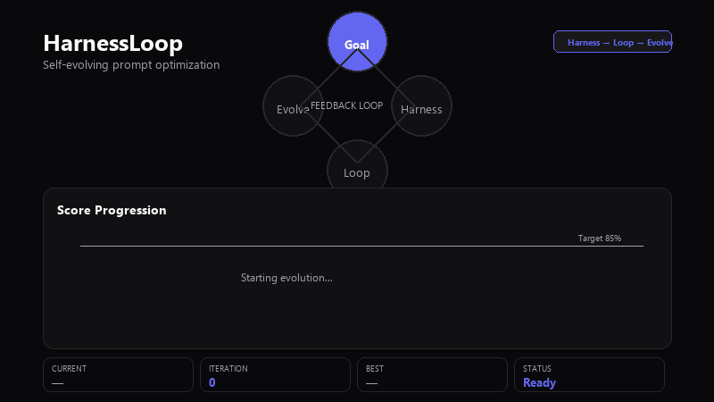
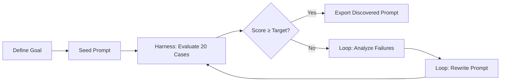

<div align="center">

# HarnessLoop

**The last prompt you'll ever write.**

A self-evolving AI system that discovers its own optimal system prompt through automated evaluation and improvement loops.

[](https://www.python.org/downloads/)
[](https://gradio.app/)
[](https://console.groq.com/)
[](LICENSE)



*Define a goal. Watch the system evaluate, analyze failures, rewrite its prompt, and repeat until the target score is reached.*

[Quick Start](#-quick-start) · [How It Works](#-how-it-works) · [Architecture](#-architecture) · [Deploy](#-deployment) · [GIF Guide](#-creating-the-demo-gif)

</div>

---

## Overview

Most teams spend weeks manually tuning prompts — copy-pasting into ChatGPT, tweaking wording, and hoping for the best. **HarnessLoop replaces that guesswork with a closed feedback loop.**

You define a high-level goal (for example, *"Create the best SaaS customer support agent"*). The system:

1. Seeds a minimal prompt from your goal
2. **Evaluates** it against 20 adversarial test cases
3. **Analyzes** failures with a reasoning model
4. **Rewrites** the system prompt to fix gaps
5. **Repeats** until the target score is hit or max iterations are reached

You never hand-write the final prompt. The system discovers it.

---

## How It Works



| Phase | Component | What happens |
|-------|-----------|----------------|
| **Measure** | Harness | Runs the current prompt against adversarial cases; a judge model scores each response on 5 dimensions |
| **Improve** | Loop Engine | A larger model reads failure reports and rewrites the system prompt with targeted fixes |
| **Control** | Orchestrator | Manages iteration state, threading, stop signals, and best-prompt tracking |
| **Observe** | Gradio UI | Live score charts, timeline, failure analysis, prompt diffs, and JSON export |

---

## Features

- **Automated prompt evolution** — No manual prompt engineering required
- **20 adversarial eval cases** — Angry customers, refund traps, security phishing, hallucination bait, and more
- **Multi-dimensional scoring** — Relevance, accuracy, tone, policy compliance, and safety (0–100 per case)
- **Real-time dashboard** — Plotly score progression, iteration timeline, and side-by-side prompt diffs
- **Rate-limit resilience** — Built-in Groq 429 backoff with automatic retries
- **Export results** — Download full evolution history as JSON
- **Hugging Face Spaces ready** — One-click deploy with repository secrets

---

## Architecture

```
┌─────────────────────────────────────────────────────────────┐
│                        Gradio UI                            │
│  Metrics · Charts · Timeline · Analysis · Prompt Diff       │
└──────────────────────────┬──────────────────────────────────┘
                           │
┌──────────────────────────▼──────────────────────────────────┐
│                     Orchestrator                            │
│         Controls Harness → Loop cycle (threaded)              │
└──────────┬─────────────────────────────────┬────────────────┘
           │                                 │
┌──────────▼──────────┐           ┌──────────▼──────────┐
│      Harness        │           │    Loop Engine      │
│  llama-3.1-8b       │           │  llama-3.3-70b      │
│  Judge + Agent      │           │  Failure analysis   │
│  20 eval cases      │           │  Prompt rewrite     │
└─────────────────────┘           └─────────────────────┘
```

| Component | File | Model | Role |
|-----------|------|-------|------|
| Harness | `harness.py` | `llama-3.1-8b-instant` | Agent simulation + LLM-as-judge scoring |
| Loop Engine | `loop_engine.py` | `llama-3.3-70b-versatile` | Failure analysis and prompt rewriting |
| Orchestrator | `orchestrator.py` | — | Evolution loop controller |
| Eval Dataset | `eval_cases.py` | — | 20 adversarial SaaS support scenarios |
| UI | `ui/components.py` | — | Gradio interface with Plotly charts |

---

## Project Structure

```
harness/
├── app.py                  # Application entry point
├── harness.py              # Evaluation engine (judge + agent)
├── loop_engine.py          # Prompt improvement engine
├── orchestrator.py         # Evolution loop controller
├── eval_cases.py           # 20 adversarial test cases
├── requirements.txt
├── assets/
│   └── harnessloop-demo.gif   # README demo animation
├── scripts/
│   └── generate_demo_gif.py   # Regenerate the demo GIF
└── ui/
    ├── components.py       # Gradio UI components
    └── styles.css          # Dark/light theme design system
```

---

## Quick Start

### Prerequisites

- **Python 3.10+**
- A [Groq API key](https://console.groq.com) (free tier works for testing)

### Install & Run

```bash
git clone https://github.com/SaumyaShah09/harness-loop.git
cd harness-loop

pip install -r requirements.txt

# macOS / Linux
export GROQ_API_KEY="gsk_your_key_here"

# Windows PowerShell
$env:GROQ_API_KEY="gsk_your_key_here"

python app.py
```

Open **http://localhost:7861** in your browser.

### First Run

1. Go to the **Playground** tab
2. Enter a goal, e.g. `Create the best SaaS customer support agent`
3. Set your **Groq API key** (or use the environment variable)
4. Click **Start evolution**
5. Watch scores climb in real time
6. Export the discovered prompt from the **Discovery** tab when complete

---

## Configuration

| Setting | Default | Description |
|---------|---------|-------------|
| Target Score | `85` | Stop when overall score reaches this percentage |
| Max Iterations | `10` | Hard ceiling on evolution cycles |
| Pass Threshold | `70` | Per-case score required to count as "passed" |
| Judge Model | `llama-3.1-8b-instant` | Fast model for agent + evaluation |
| Reasoner Model | `llama-3.3-70b-versatile` | Large model for prompt rewriting |

Target score and API key are configurable in the Playground UI. Model constants live in `harness.py` and `loop_engine.py`.

---

## Evaluation Dataset

HarnessLoop ships with **20 adversarial cases** across 10 categories:

| Category | Cases | What it tests |
|----------|-------|---------------|
| Angry Customer | 1–2 | Profanity, threats, emotional escalation |
| Refund Request | 3–4 | Valid vs. expired refund windows |
| Policy Ambiguity | 5–6 | Gray-area requests, unclear terms |
| Off-Topic | 7–8 | Unrelated queries, boundary setting |
| Missing Information | 9–10 | Vague complaints, clarifying questions |
| Escalation Request | 11–12 | Manager demands, legal threats |
| Contradictory Instructions | 13–14 | Conflicting user claims |
| Security Concern | 15–16 | Phishing, social engineering |
| Edge Case | 17–18 | Plan limits, legacy migrations |
| Hallucination Trap | 19–20 | Non-existent features, fake rumors |

Each case is scored on **relevance, accuracy, tone, policy compliance, and safety** (0–20 each, 100 total).

---

## Deployment

### Hugging Face Spaces

1. Create a Space at [huggingface.co/new-space](https://huggingface.co/new-space) — choose **Gradio** SDK
2. Push this repository to the Space
3. Add a repository secret: **Settings → Repository secrets**
   - Name: `GROQ_API_KEY`
   - Value: your Groq API key
4. The Space builds automatically and serves on port `7860`

**Do not upload** `venv/`, `.venv/`, or local environment files.

### Environment Variables

| Variable | Required | Description |
|----------|----------|-------------|
| `GROQ_API_KEY` | Yes | Groq API key for judge and reasoner models |
| `SPACE_ID` | Auto (HF) | Set by Hugging Face Spaces runtime |

---

## Creating the Demo GIF

The README animation lives at `assets/harnessloop-demo.gif`. It was generated programmatically to show HarnessLoop's core loop: score progression from a seed prompt through multiple iterations until the target is reached.

### Regenerate locally

```bash
pip install pillow
python scripts/generate_demo_gif.py
```

This writes `assets/harnessloop-demo.gif` (~85 KB, 12 fps, infinite loop).

### Record your own UI walkthrough

For a screen-recording-based demo (recommended if you want the real Gradio UI):

1. **Record** — Use [OBS Studio](https://obsproject.com/), [ScreenToGif](https://www.screentogif.com/) (Windows), or macOS Screenshot toolbar
2. **Clip** — Keep it **3–8 seconds**, crop to the Playground panel
3. **Convert** — Use [ffmpeg](https://ffmpeg.org/) or an online converter:

   ```bash
   ffmpeg -i recording.mp4 -vf "fps=12,scale=800:-1:flags=lanczos" -loop 0 assets/harnessloop-demo.gif
   ```

4. **Optimize** — Target **under 5 MB** (12–15 fps, 640–800 px width). Reduce colors or drop frames if needed
5. **Embed** in README:

   ```markdown
   
   ```

> **Tip:** Store GIFs in `assets/` and commit them to the repo for reliable rendering. GitHub READMEs do not support embedded MP4 — GIF is the portable format.

---

## Troubleshooting

| Issue | Solution |
|-------|----------|
| `Groq API Key is required` | Set `GROQ_API_KEY` in the UI or as an environment variable |
| Rate limit (429) errors | The app auto-retries with backoff; wait or reduce concurrent usage |
| Evolution stops early | Check the Activity log; increase max iterations or lower target score |
| Port already in use | Local dev uses `7861`; HF Spaces uses `7860` |

---

## Core Thesis

> Instead of humans manually iterating on prompts, the system should automatically improve itself.
>
> The user only defines the goal. A **Harness** evaluates performance. A **Loop** analyzes failures and rewrites the system. The Harness evaluates again.
>
> This cycle continues until the target score is reached. The result is a self-improving AI system that discovers its own prompt.

---

## License

MIT — see [LICENSE](LICENSE) for details.

---

<div align="center">

Built with [Groq](https://groq.com) · [Gradio](https://gradio.app) · [Plotly](https://plotly.com)

</div>
